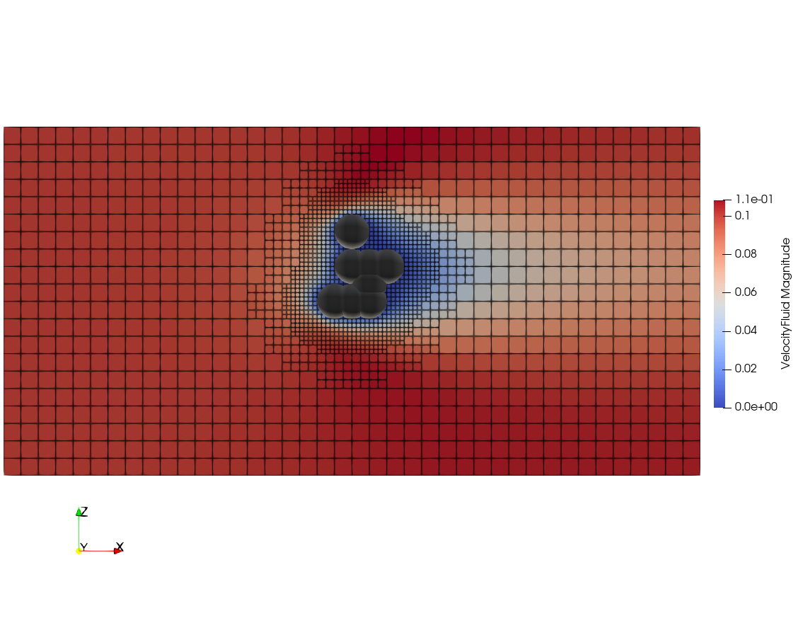

Data Folders
============
Data
----
This folder contains csv files for different runs generated by the *main* file, and if any more simulations are performed a new csv files will be created.
data2024-04-03 is the one used in this project, the others are experimental and different setups. The CSV file is structured as follows; each row is the result and varaibles used for one simulation,
each column is a separate feature or result. For specific names of features check the csv file or the main script in which the names are specified.

Figures
-------
This folder contains various figures showcasing the performance of the model or the simulation setup. An example image below:

Models
------
The model folder is made to collect and save all outputs coming from the neural network models. This includes the file (.pth) for the saved model as well as all figures created by the models. The saved model file saves all weights and biases in the network after training and thus the training does not need to be re-run.

ONXX
-----
This folder contains ONNX files for the different model structures used and a script (outdated) to generate onxx files.

Pictures
--------
This folder contains images of particle clusters generated by the *main* file. Each subfolder contains one simulation run and is named after the date it the simulation started, and within
this folder 3 which divied the images to different angles. As with the data folder, we reccomend using the 2024-04-03 folder. An example image below:

Vtkfiles
--------
This folder contains vtk files for each particle cluster created in a simulation run which can be used to ensure correct formation of particle clusters by using software such as paraviewer
Each subfolder is named to the date when the simulation run started and the number after "P" in each vtk files indicates the number of particles in the cluster.

Xmffiles
--------
This folder contains xmf files for each simulation performed in *main* which can be used to ensure correct simulation and domain setup by using software such as paraviewer.

