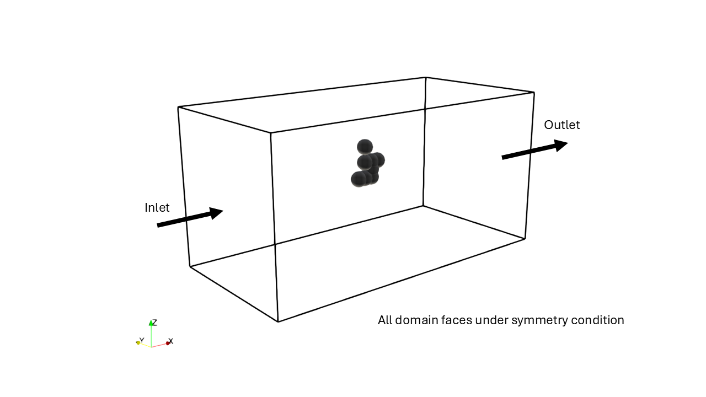

Project Description
===================
This document will briefly explain the structure and code of the project repository AI-
CFD/Soot particle. 

**Aim**

This project aim to propose and evaluate a method to make fluid simulations quicker by predicting one, 
or several output variables from the solver. In the current setup the variable to be predicted is the drag coeffiecient, 
based on a some basic simulation variables and images of the particle cluster used in the simulation. The CFD solver used for this project is IBOFLOW.

This is done using all code described throughout this document. The overall workflow is as follows; firstly, data is collected from simulations using Iboflow, 
then the data is used to train different machine learning models which are in turn evaluated. The machine learning models include SVR, 
neural network and an ensemble model consisting of a neural network, a convolutional neural network and a final meta neural network. 
These are all evaluated using statistical metrics such as root mean square, mean absolute error and r^2-score. The predicted values are also compared to the simulated 
values in plots for all models.

----

For a more detailed description about this project and its finding please read this :download:`PDF document <FCC_report.pdf>`.
